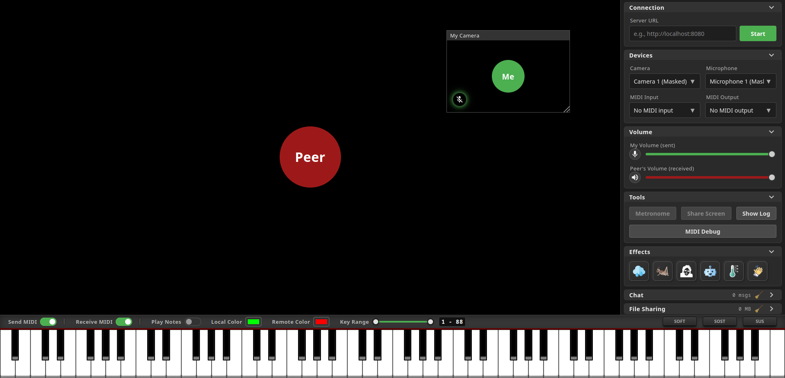

# MidiCam

MidiCam is a collaborative, peer-to-peer WebRTC application designed for real-time online music lessons and virtual piano training. It enables two musicians to see each other via low-latency video, talk, text, share files, and - most importantly - interact through a fully synchronized 88-key virtual piano powered by real-time MIDI.

*Note: Achieving true real-time, ultra-low-latency audio/video synchronization over weak internet connections is a major technical challenge. This project needs to be more optimized for the best possible network tuning.*




---

## 🚀 Key Features

### 🎛️ Real-Time P2P Streaming & Layout
* **Video/Audio:** Direct Peer-to-Peer connection using WebRTC technology.
* **Interactive Floating Windows:** Drag, resize, or maximize your local video preview anywhere on your viewport.
* **Offline History:** Chat and file histories are persistent across sessions, stored locally using the browser's native `IndexedDB` database.

### 🎹 Synchronized Virtual Piano (88-Keys)
* **Web MIDI API Integration:** Connect your physical digital piano/MIDI keyboard; keystrokes are registered locally and sent instantly to your peer.
* **MIDI Output Forwarding:** Forward incoming MIDI notes from your peer directly to your local hardware synthesizer or DAW.
* **Dynamic Range Selection:** Select specific key ranges (e.g., limiting the view to a specific octave) via an elegant dual-range slider.
* **Pedal Synchronization:** Full support for Sustain (Cc 64), Sostenuto (Cc 66), and Soft (Cc 67) pedals.
* **Acoustic Synthesizer:** Built-in grand piano sample synthesis powered by realistic pre-rendered audio (smplr.mjs)
* **Color Customization:** Personalize colors for your local keys and incoming peer keystrokes.

### ⏱️ Shared Synchronized Metronome
* **Cooperative Metronome:** Perfect state-syncing across both screens (BPM, beats, play/pause status).
* **Master/Slave Synchronization:** Double-click to claim Mastership. The master runs the high-precision audio scheduler, sending perfectly timed tick signals to the slave.

### 📡 Network & MIDI Diagnostics Dashboard
* **Adjustable Protocol Select:** Toggle between UDP-like transport (`WebRTC Unordered` to prevent rubber-banding/head-of-line blocking) and TCP-like transport (`WebRTC Ordered`), or fall back to standard WebSockets.
* **Mini-Format Encoding (MINI Codec):** Combines multiple notes into single combinatorial chord-encoded packages to mitigate the "arpeggio effect" and significantly reduce bandwidth.
* **Microtask Packet Batching:** Bundle notes played within the same millisecond into highly efficient single packets.
* **Adjustable Jitter Buffer:** Fine-tune latency with an artificial buffer (0–1000ms) to smooth out uneven internet connections.
* **Telemetry Monitors:** Real-time diagnostics showing Ping (RTT), Jitter, Packet loss, and packet counters for both peers.

### 💬 Collaborative Extras
* **Drag-and-Drop File Sharing:** Send sheet music, audio tracks, or documents up to several gigabytes directly via WebRTC data chunks.
* **Local Chat:** A simple native chat module with system notification sounds and popups.
* **Screen Sharing Support:** Stream a specific application window or your entire screen into a resizable floating window.
* **Dynamic Visual Effects:** Trigger fun synchronized interactive overlay effects (Rain, Applause, Tumbleweeds, etc.).

---

## 🛠️ Architecture & Tech Stack

MidiCam is built entirely with native, modern web technologies requiring no build steps, bundlers, or transpilers on the frontend.

* **Frontend:** Vanilla HTML5, CSS3, ECMAScript modules (ESM)
* **Signaling Server:** Node.js + `ws` (WebSockets)
* **P2P Audio/Video/Data:** WebRTC
* **Audio Engine:** Web Audio API (integrating a custom-adapted `smplr` library)
* **Local Database:** IndexedDB (No SQL, entirely local, GDPR-compliant by design)
* **Starter Scripts:** Python 3 (standard library)

---

## ⚠️ Requirements & Platform Notes

* **Operating System:** Tested and optimized for **Linux** (Ubuntu/Debian distributions). The launch scripts (`run_local.py` & `run_remote.py`) are designed for Unix-like environments.
* **Secure Context (HTTPS):** Modern web browsers **block** WebRTC camera/microphone access and Web MIDI APIs on non-secure connections. You **must** access MidiCam via `localhost` (for local tests) or over an encrypted `https://` connection (for remote sessions). For example, you can use ngrok to easily tunnel your local server securely and easily without needing an own webserver hosting.

---

## ⚙️ Installation & Setup

Ensure you have **Node.js** and **Python 3** installed on your system.

### 1. Install Server Dependencies
Before running the application, you must install the required dependencies for the signaling server. Navigate to the `server` directory and run:

```bash
cd server
npm install
```

---

### 2. Local Setup (Testing on the same machine)
To test MidiCam locally, you need to spin up the signaling server and a local web server to host the static client files.

#### Step A: Start the Signaling Server
Open a terminal, navigate to the `server` directory, and run the Node.js server (it will listen on port `8080` by default):

```bash
cd server
node server.js
```

#### Step B: Start the Client Web Server
Open a second terminal, navigate to the `client` directory, and start a simple HTTP server using Python (this will serve the frontend on port `8081`):

```bash
cd client
python3 -m http.server 8081
```

#### Step C: Connect the Clients
1. Open **two** browser tabs or windows and navigate to `http://localhost:8081`.
2. In the **Server URL** input field in the sidebar of both tabs, enter `http://localhost:8080`.
3. Click the green **Start** button on both clients. The Peer-to-Peer WebRTC connection will be established instantly.

---

### 3. Remote Setup (Connecting with a peer over the internet)
Because modern web browsers **strictly require a Secure Context (HTTPS)** to allow access to cameras, microphones, and MIDI devices, running MidiCam over the internet requires secure tunneling.

You can use **ngrok** to easily expose both your local signaling server and your local client web server to the internet over secure HTTPS/WSS.

#### Step A: Run the Local Servers
Start both the signaling server and the client HTTP server locally using the commands described in the **Local Setup** above (Server on port `8080`, Client on port `8081`).

#### Step B: Tunnel the Signaling Server
Open a new terminal and expose your signaling server (port `8080`) to the public internet:

```bash
ngrok http 8080
```
*   ngrok will generate a secure forwarding URL (e.g., `https://xxxx-xx.ngrok-free.app`).
*   **Write this URL down.** This is your **Signaling Server URL** (it automatically handles standard secure WebSockets `wss://` over port `443`).

#### Step C: Tunnel the Client Web Server (For your Peer)
Since your remote peer must load the frontend over HTTPS to grant browser MIDI/camera permissions, you must also expose your client web server (port `8081`):

```bash
ngrok http 8081
```
*   ngrok will generate a second secure forwarding URL (e.g., `https://yyyy-yy.ngrok-free.app`).
*   **Send this Client URL to your peer.**

#### Step D: Establish the Remote Connection
1. **You** can open your local browser at `http://localhost:8081`.
2. **Your peer** must open their browser using the secure client URL you sent them (e.g., `https://yyyy-yy.ngrok-free.app`).
3. Both you and your peer must enter the **Signaling Server URL** (e.g., `https://xxxx-xx.ngrok-free.app:443`) into the **Server URL** field in the sidebar.
4. Both click the green **Start** button to connect over the internet!

## 📚 Credits & Third-Party Code

MidiCam relies on a highly curated collection of lightweight tools:

* **smplr (SplendidGrandPiano)**: Sound generation is powered by an adapted version of [danigb/smplr](https://github.com/danigb/smplr), licensed under the MIT License. Samples are preloaded and played back locally.
* **marked.js**: Markdown parsing for dialogs and logs, served via CDN.
* **Icons & Vector Graphics**: Standard vector assets mapped out in `credits.txt`. Many thanks to the respective open-source creators of the SVG visuals!

---

## 📄 License

This project is licensed under the **MIT License**. Feel free to use, modify, and distribute it as you see fit. See the [LICENSE](LICENSE) file for details.
